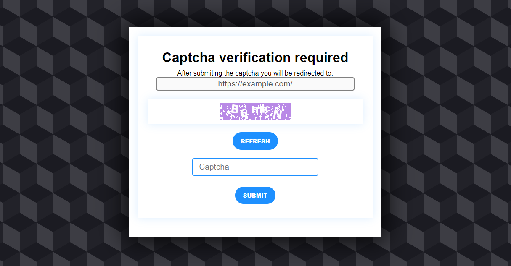

## Introduction

apache2-captcha is a simple captcha verification to prevent bots from accessing your site or specific folders as apache2 doesn't have any effectively way to protect itself from bots

apache2-captcha is made using PHP and some apache2 config.

# Table of contents

1. [Documentation](#documentation)
2. [Download](#download)
3. [Security Concerns](#security-concerns)
4. [Credits](#credits)
5. [License](#license)

## Documentation
To see the repository documentation head to the wiki page
- [Wiki](https://github.com/ProperLab/apache2-captcha/wiki)

## Download
You can download this repository from the link below. Please note that you need an apache2 installation with PHP
- [Download Link](https://github.com/ProperLab/apache2-captcha/releases)
- [Installation Guide](https://github.com/ProperLab/apache2-captcha/wiki/Installation-Guide)

## Security Concerns
See [Security Concerns](https://github.com/ProperLab/apache2-captcha/wiki/Security-Concerns) for more info about this bot prevention system.

## Credits
apache2-captcha is a product of [MakerLab](https://makerlab.sytes.net) and [ProperCloud](https://propercloud.sytes.net)

## License
apache2-captcha is released under the MIT License.
See [LICENSE](LICENSE) for more details.